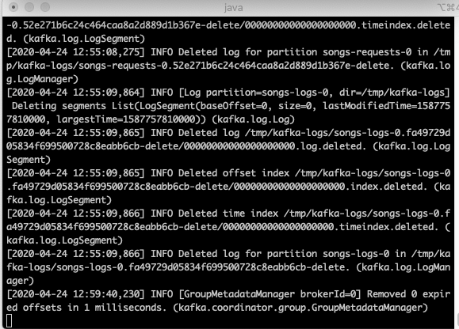

# YouTube Kakfa playlist

A simple example to demonstrate integration with YouTube Data API V3 and Kafka. Listens to a kafka queue for song requests, and adds video to a YouTube playlist.

No experience with kafka or YouTube APIs required


## How this could be used?

If you are playing a playlist on your TV, you will no longer need to give your WiFi password to guests, but can still let them add songs to your playlist.

## Watch this in action (video/screencast)

- Via web UI: https://youtu.be/zz3hpK_vB-0
- Via command line interface: https://youtu.be/IIl6h1mPEjw


## One time setup

1. Create an app on https://console.cloud.google.com/ and set up Oauth

You will need client_secret and app id later

2. Create a playlist where you want to add songs

You will need the playlist id

3. Set up project

- Use Git or checkout with SVN using the web URL. https://github.com/rishirdua/kakfa-youtube.git
- Add the client secret and the playlist id to `SongsProcessor.java`**
- Update the playlist ID with the playlist ID from step 3 above.

**Step 4. Install kafka**

- https://kafka.apache.org/downloads
- Enable deleting kafka topics [link](https://kafka.apache.org/quickstart). Set `delete.topic.enable=true` as we'll use that to clean up topics from previous runs

## How to use

You will probably need a different terminal tab for each of these steps

1. Run zookeeper

```
bin/zookeeper-server-start.sh config/zookeeper.properties
```


2. Run kafka

```
bin/kafka-server-start.sh config/server.properties
```



3. Set up kafka topics

```
### Delete topics if they exist from previous runs
bin/kafka-topics.sh --zookeeper localhost:2181 --topic songs-requests --delete
bin/kafka-topics.sh --zookeeper localhost:2181 --topic songs-logs --delete

### Create topics
bin/kafka-topics.sh --create --bootstrap-server localhost:9092 --replication-factor 1 --partitions 1 --topic songs-requests
bin/kafka-topics.sh --create --bootstrap-server localhost:9092 --replication-factor 1 --partitions 1 --topic songs-logs

### List topics (to verify everything is in order)
bin/kafka-topics.sh --list --bootstrap-server localhost:9092
```


5. Compile and run the program

Compile
```
/Library/Java/JavaVirtualMachines/jdk1.8.0_212.jdk/Contents/Home/bin/java -Dmaven.multiModuleProjectDirectory=/Users/rdua/kafka/songsqueue "-Dmaven.home=/Applications/LI IntelliJ IDEA 2019.3.app/Contents/plugins/maven/lib/maven3" "-Dclassworlds.conf=/Applications/LI IntelliJ IDEA 2019.3.app/Contents/plugins/maven/lib/maven3/bin/m2.conf" "-Dmaven.ext.class.path=/Applications/LI IntelliJ IDEA 2019.3.app/Contents/plugins/maven/lib/maven-event-listener.jar" "-javaagent:/Applications/LI IntelliJ IDEA 2019.3.app/Contents/lib/idea_rt.jar=54847:/Applications/LI IntelliJ IDEA 2019.3.app/Contents/bin" -Dfile.encoding=UTF-8 -classpath "/Applications/LI IntelliJ IDEA 2019.3.app/Contents/plugins/maven/lib/maven3/boot/plexus-classworlds-2.6.0.jar" org.codehaus.classworlds.Launcher -Didea.version2019.3.3 compile
```


Run
```
mvn exec:java -Dexec.mainClass=com.rishidua.SongsProcessor
```


6. For command line version, start the consumer using the command below. For UI version, set up a webhost as well
```
bin/kafka-console-producer.sh --broker-list localhost:9092 --topic songs-requests
```

7. Set up a web UI to take inputs (optional)

Run the following from the web directory

```
php -S localhost:8000
```

Go to the browser and start queueing songs.


To enable conections from outside your home WiFi network via your public IP, set up forwarding requessts to 8000 (or any port of your choice) to your machine on your router settings (usually in some kind of firewall settings).

7. Stream the logs (optional)
```
bin/kafka-console-consumer.sh --bootstrap-server localhost:9092 --topic songs-logs --from-beginning
```


## Caveats

This was a weekend project, so it has limited error handling and some hardcoded things

1. Update file location in index.php so that it points to your kafka implementation.
2. I've assumed all kafka and zookeeper isntances run at their default ports. These are hardcoded and will require changing if your setup is different.
2. The demo in the video routes via internal IP address, 192.168.0.x, which defeats the purpose as you'll have to share your WiFi password. At that point, using Chromecast is much easier. However the video is for demo purposes only. In a real application, this would need setting up hosting with a kafka instance and connecting to the host IP (or domain name).
3. Very limited capabilities. eg: you canot remove a video from playlist., this doesn't check rate limits. The retry for YouTube API doesn't use any backoffs etc.
4. This was a weekend project, I do not plan to maintain or add features, however pull requests are most welcome if you want to improve this.

## Challenge

The biggest challenge was understanding this 302 error response that occassionaly happens with YouTube data API. I've implemented the most hacky solution for now (retry 3 times without any backoff)

```
com.google.api.client.googleapis.json.GoogleJsonResponseException: 302 Found
{
  "code" : 302,
  "errors" : [ {
    "domain" : "global",
    "message" : "Unknown Error.",
    "reason" : "backendError"
  } ],
  "message" : "Unknown Error.",
  "status" : "UNKNOWN"
}
```

The official documentation lists a bunch of possible errors, but not this one

https://developers.google.com/youtube/v3/docs/core_errors

Here's my Tweet talking more about the error:

